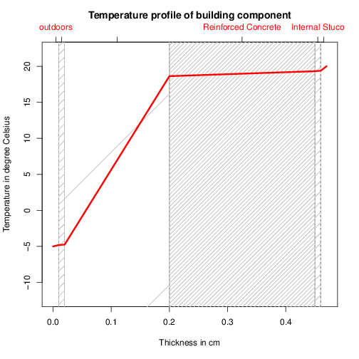
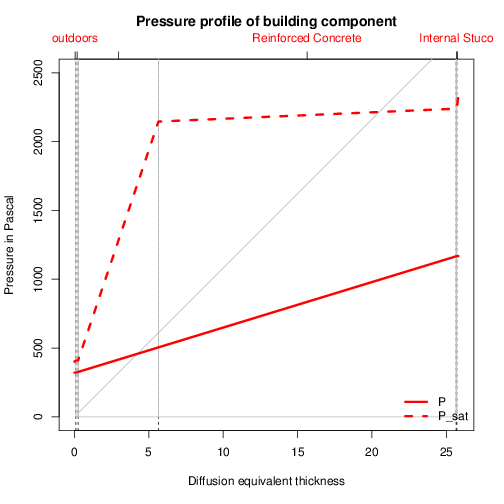
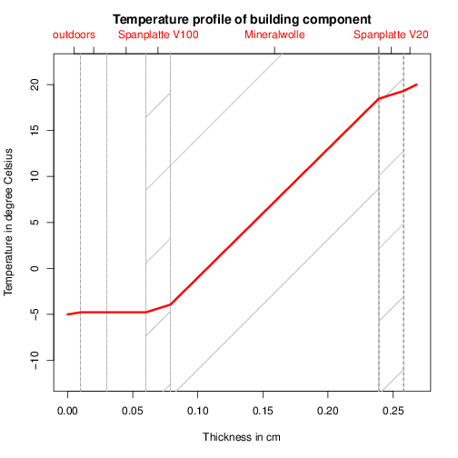
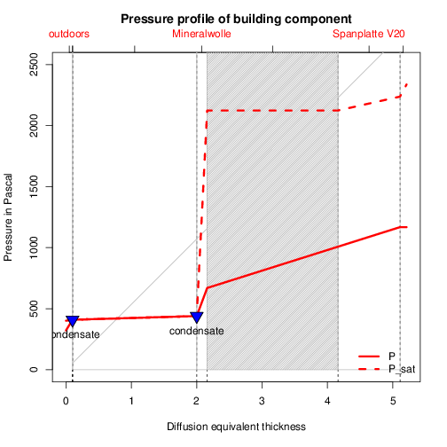
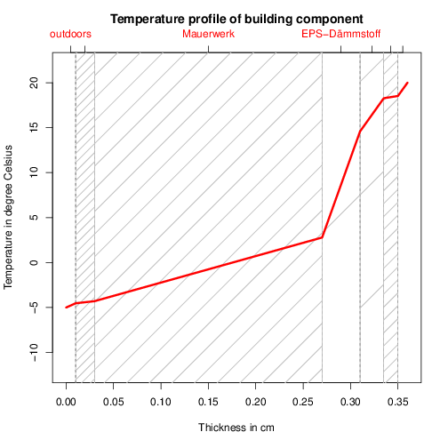
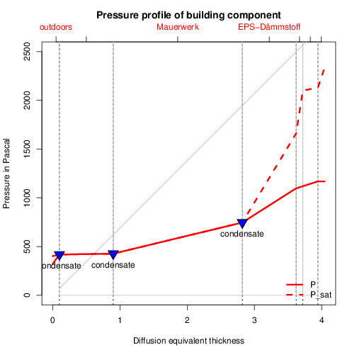
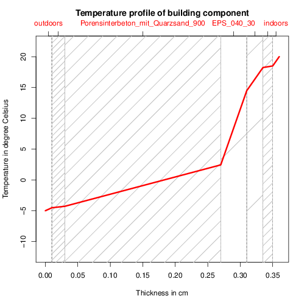
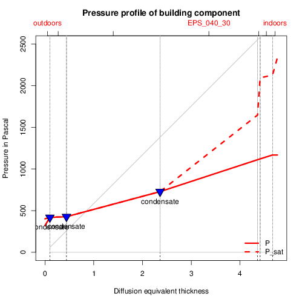

UvalR
=====

This simple scrip computes the U-Value for building components given the
characteristics of the individual layers of the component. The scrip also has a
small implementation which reads from an external file the properties of the
individual layers given an specific name. In order to make the functions
described on the main script 'Uval.R' you have to run in within your working
session via::

    source("./Uval.R")

This means that the main script 'Uval.R' has to be in the working path of your
environment. You can't just call the scrip using an absolute path as the scrip
will use the folder structure of the root folder. The easiest way to make sure 
that R finds the scrip is to point R into the right directory with the 'setwd()' 
command::

    setwd("~/workspace/R/UvalR")

The root folder structure is as follows::

    + root
    |---Data     # The scrip will look for a csv file containing materials data
    |               in this directory. The csv name has to be 'materials.csv'
    |---Examples # Some examples on how to run the script.
    |---FIGURES  # The scrip will store the plots here.
    |---TABLES   # And the corresponding result data here.

The examples:
-------------

All the examples presented below are stores in the folder './Examples/'.

1) Reinforced concrete.
   
   .. include:: ./Examples/ReinforcedConcrete.R
      :code:
   
   This scrip will output the value: 0.1973745, that the U value of the
   building component in [W/m2K]
   
   It will also write two figures in folder './FIGURES/'

2) Light outside wall (Leichte Außenwand).
   
   .. include:: ./Examples/LeichteAussenwand.R
      :code:
   
   This scrip will output the value: 0.2240037, that the U value of the
   building component in [W/m2K]
   
   It will also write two figures in folder './FIGURES/'

3) Internal insulation (Innendämmung).
   
   .. include:: ./Examples/InnenDaemmung.R
      :code:
   
   This scrip will output the value: 0.4719366, that the U value of the
   building component in [W/m2K]
   
   It will also write two figures in folder './FIGURES/'

4) Using an external data file.

   This examples uses an external data file containing the properties of the
   different material layers. 
   
   .. include:: ./Examples/ExternalData.R
      :code:
   
   This scrip will output the value: 0.4814479, that the U value of the
   building component in [W/m2K]
   
   It will also write two figures in folder './FIGURES/'

